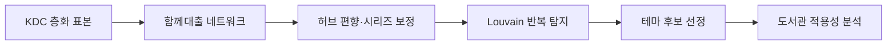

# 분류를 넘어선 연결
### 함께 읽힌 기록으로 구성하는 융합형 테마 서가

**전국 공공도서관 대출 네트워크 분석에 기반한 사서 서가 구성 지원 도구**  
**2026 도서관 데이터 활용 공모전 · 서비스 아이디어 제안 부문 · 개인 프로젝트**

> **Cross-Shelf**는 KDC를 대체하지 않습니다.  
> 기존 분류와 배가는 그대로 유지하고, 실제 대출 기록에서 반복적으로 함께 선택된 도서를 찾아 **새로운 큐레이션 후보를 발굴하는 보조 층위**를 제안합니다.

---

## 프로젝트 개요

도서관의 KDC 분류는 자료 관리와 검색에 효과적이지만, 이용자의 관심사는 하나의 분류 안에만 머물지 않습니다.

정보나루의 함께대출 관계를 분석한 결과, 최종 네트워크 연결의 **64%가 서로 다른 KDC 대분류를 가로질렀습니다.**  
이 프로젝트는 도서를 노드, 함께대출 관계를 엣지로 하는 네트워크를 구성하고, 분류를 넘어 반복적으로 함께 묶이는 도서를 **융합형 테마 서가 후보**로 발굴합니다.

### 핵심 원칙: 데이터가 발굴하고, 사서가 판단한다

| 구분 | 기존 큐레이션 | 본 제안 |
|---|---|---|
| 테마 발굴 | 사서가 직접 구상 | **대출 데이터가 후보 발굴** |
| 후보 범위 | 떠올릴 수 있는 조합 | **예상 밖 조합까지** |
| 근거 | 경험과 직관 | **전국 대출 기록** |
| 최종 판단 | 사서 | **사서** |

---

## 핵심 결과

- 초기 수집: **751권 · 2,059건의 방향성 관계**
- 최종 함께대출 네트워크: **166권 · 432쌍**
- 분류 교차율: **21% → 68% → 64%**
- 최종 제안: **3개 테마 서가 · 총 35권**
- 서울 **352개 도서관**이 최소 1권 이상 보유
- **22개 도서관**이 35권 전권 보유

| 테마 서가 | 도서 수 | KDC 대분류 | 교차율 | 검증율 |
|---|---:|---:|---:|---:|
| **아이와 함께 자라는 부모의 서가** | 14권 | 6개 | 76% | 48% |
| **위로가 필요한 날의 소설과 교양** | 11권 | 4개 | 48% | 86% |
| **웃으며 읽는 어린이 교양** | 10권 | 5개 | 67% | 75% |

대표 사례인 **「아이와 함께 자라는 부모의 서가」**는 성인 육아·양육서 8권과 아동 대상 도서 6권이 KDC 6개 대분류를 넘어 하나의 독서 맥락으로 연결된 결과입니다.

---

## 분석 흐름



1. 인기순 표본의 문학 편중을 확인하고 **KDC 10개 대분류 층화 추출**로 전환
2. 정보나루 `coLoanBooks`를 이용해 **책-책 함께대출 네트워크** 구축
3. **역연관빈도**로 인기 도서의 허브 편향을 완화하고, 23개 시리즈·98권을 대표 노드로 정리
4. Louvain을 **3개 resolution × 10개 seed = 총 30회** 반복해 안정적인 후보 탐지
5. 규모·KDC 다양성·허브 편중·내부 연결강도 기준으로 테마 선정
6. 서울 도서관의 **소장 및 대출 가능 상태**를 결합해 실제 운영 가능성 검토

---

## 실제 도서관 적용 사례

최종 35권을 서울 도서관 소장 목록과 대조한 뒤, 대출 가능 여부에 따라 **전시형 / 안내형** 운영 가능성을 비교했습니다.

| 사례관 | 전시형 | 안내형 | 미소장 |
|---|---:|---:|---:|
| **강남구립개포하늘꿈도서관** (약 4만 권) | 3권 (9%) | 32권 (91%) | 0권 |
| **성동구립도서관** (약 44만 권) | 21권 (60%) | 13권 (37%) | 1권 (3%) |

같은 테마라도 도서관 규모와 대출 상태에 따라 운영 방식이 달라질 수 있음을 확인했습니다.

또한 「위로가 필요한 날의 소설과 교양」에서는 **『요즘 어른을 위한 최소한의 세계사』**가 연결강도 상위 100%, 대출 순위 하위 9%로 나타나 **저대출 장서의 재발견 가능성**을 확인했습니다.

---

## Repository Structure

```text
Cross-Shelf/
├── README.md
├── src/
│   ├── 01_build_network.py
│   ├── 02_detect_clusters.py
│   ├── 03_enrich_clusters.py
│   ├── 04_analyze_library_fit.py
│   ├── 05_find_buried_books.py
│   ├── 06_visualize_results.py
│   └── common.py
├── data/
│   ├── network_edges.csv
│   ├── weighted_edges.csv
│   ├── cluster_summary.csv
│   ├── selected_books.csv
│   ├── library_fit.csv
│   └── buried_books.csv
├── outputs/
│   ├── network_overview.png
│   └── parent_shelf_detail.png
├── docs/
│   └── proposal.pdf
├── requirements.txt
└── .env.example
```

API 원본 JSON 응답은 공개 저장소의 가독성과 용량을 위해 제외하고, 분석 흐름을 확인할 수 있는 가공 데이터와 최종 산출물만 포함했습니다.

---

## Data & Tech

**Data**
- 도서관 정보나루 Open API
- 국립중앙도서관 국가서지 ISBN 서지정보 Open API

**Tech**
- Python
- pandas
- NetworkX
- Matplotlib
- Requests

---

## 상세 제안서

📄 **[2026 도서관 데이터 활용 공모전 최종 제안서](./docs/[서비스 아이디어 제안]융합형 테마 서가(공나예).pdf)**

---

<details>
<summary><b>실행 방법 보기</b></summary>

```bash
pip install -r requirements.txt

python src/02_detect_clusters.py
python src/03_enrich_clusters.py
python src/04_analyze_library_fit.py
python src/05_find_buried_books.py
python src/06_visualize_results.py
```

새로 API 데이터를 수집하려면 `.env.example`을 `.env`로 복사해 인증키를 설정한 뒤 `01_build_network.py`부터 실행합니다.

</details>

---

## 한계

- 대출 가능 여부는 정보나루 조회 기준으로 **전날 상태**이며, 실제 운영에는 도서관 대출관리시스템과의 실시간 연동이 필요합니다.
- 정보나루에서는 **복본 수를 제공하지 않아** 실제 전시 가능 권수와 차이가 있을 수 있습니다.
- 현재 분석은 KDC 10개 대분류에서 시드를 추출한 **파일럿 규모**이며, 시드 범위를 넓히면 더 많은 테마 후보를 발굴할 수 있습니다.

---

<sub>코드 작성 및 리팩터링 과정에서 Claude Code를 보조 도구로 활용했습니다.</sub>
